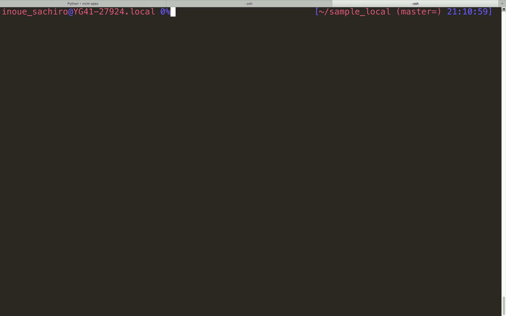

[](https://travis-ci.org/ne-sachirou/git-cleanup-branch)

git-cleanup-branch
==
Small utility to cleanup Git merged branches _interactively_ at both local and remote.

Installation
--
Supported platforms:

- MacOS X
- Linux x86_64

Download a binary from [releases](https://github.com/ne-sachirou/git-cleanup-branch/releases).

Or build it by yourself. Latest [Crystal](https://crystal-lang.org/) is required.

```sh
git clone --depth=1 https://github.com/ne-sachirou/git-cleanup-branch.git
cd git-cleanup-branch
make && make install
```

Usage
--
```sh
cd git_project
git cleanup-branch
```



CONTRIBUTING
--
- Fork the repo.
- Checkout a new feature branch.
- Implement a feature.
- Test the feature.
- Create a pull request.

Pre-requirements:

- Latest ver. of Crystal.
- Latest ver. of Ruby & Bundler.

How to test.

```sh
make test
```

TODO
--
- [ ] Too many unremoved branches.
- [ ] Windows support.
